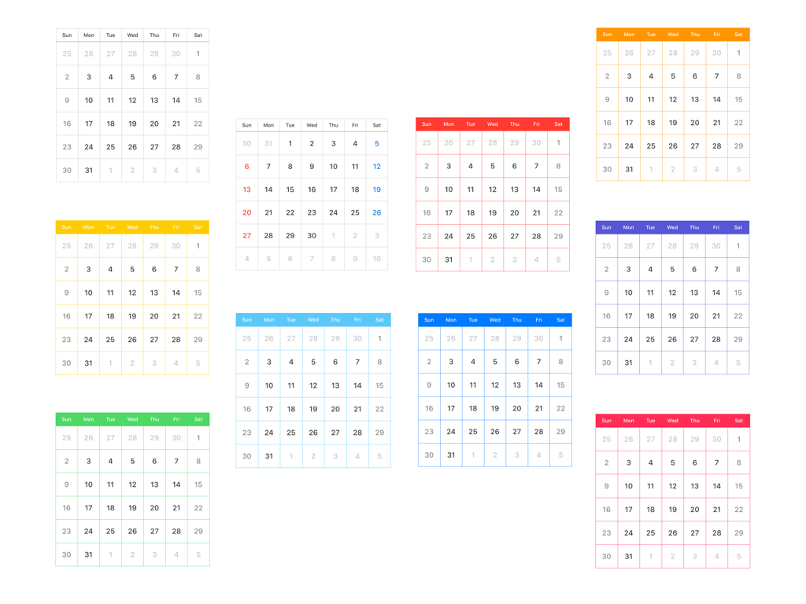
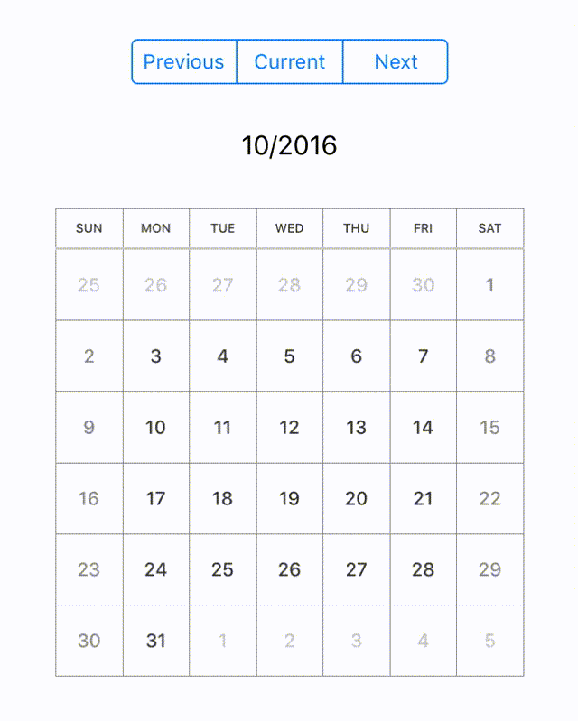
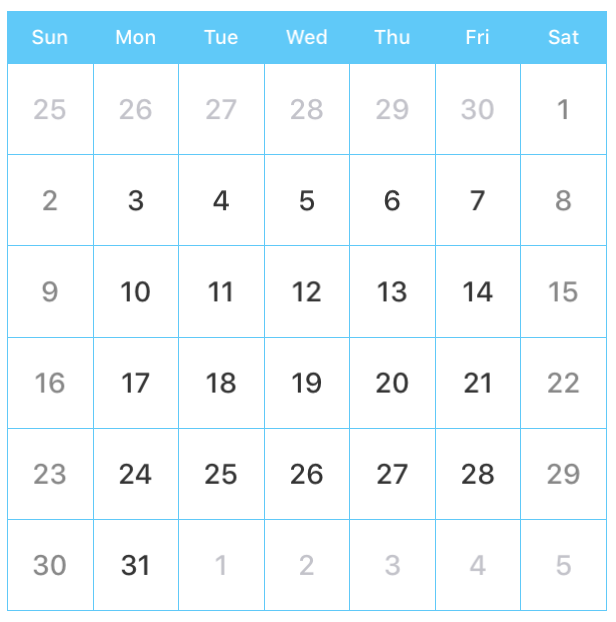

# Koyomi


[](https://developer.apple.com/swift)
[](http://mit-license.org)

**Koyomi** is a simple calender view framework for iOS, written in Swift :calendar:


<p align="center">

</p>

## Features

- Simple Calender View :calendar:
- Easily usable :sunglasses:
- Customizable in any properties for appearance
- [x] Support `@IBDesignable` and `@IBInspectable`
- [x] Support Swift 2.3
- [ ] Support Swift 3.0

## Demo App

Open `Example/Koyomi.xcworkspace` and run `Koyomi-Example` to see a simple demonstration.

## Example

Koyomi is designed to be easy to use :sunglasses:

<p align="center">

</p>


```swift
    let koyomi = Koyomi(frame: CGRect, sectionSpace: 1.5, cellSpace: 0.5, inset: UIEdgeInsetsZero, weekCellHeight: 25)
    view.addSubview(koyomi)
```

Koyomi is Available in in Interface Builder.
Set custom class of `UICollectionView `

```swift
    @IBOutlet weak var koyomi: Koyomi!
```

### Customize layout

```swift
    // padding for Calender
    koyomi.inset = UIEdgeInsets(top: 0.5, left: 0.5, bottom: 0.5, right: 0.5)
    koyomi.weekCellHeight = 25
    
    // set Day and Week Label Font
    koyomi
        .setDayFont(size: 12) 
        .setWeekFont(size: 8)
        
    // if want to change font name, use: 
    // setDayFont(fontName: ".SFUIText-Medium", size: 12)
 ```
 
Set weeks text
 
 ```swift
    // set weeks text
    koyomi.weeks = ["Sun", "Mon", "Tue", "Wed", "Thu", "Fri", "Sat"]
```

Change month, date

```swift  
    // change month
    koyomi.display(in: .next)
    
    // get current month string
    let currentDateString = koyomi.currentDateString(withFormat: "M/yyyy")
```

## KoyomiDelegate

if you want to use `KoyomiDelegate`, set `calenderDelegate`

```swift
    koyomi.calenderDelegate = self
    
    ...
    
extension ViewController: KoyomiDelegate {
    func ...
```

Return the date user selected, when tapped cell

```swift
    optional func koyomi(koyomi: Koyomi, didSelect date: NSDate, forItemAt indexPath: NSIndexPath)    
```

Return the current month string, when changed month.

```swift
    optional func koyomi(koyomi: Koyomi, currentDateString dateString: String)
    
    // if you want to change string format, use `currentDateFormat`
    koyomi.currentDateFormat = "M/yyyy"
```

## Customize properties

```swift
    // Customize layout
    @IBInspectable var sectionSpace: CGFloa
    @IBInspectable var cellSpace: CGFloat
    @IBInspectable var weekCellHeight: CGFloat
    public var inset: UIEdgeInsets
    
    // Customize color
    @IBInspectable public var sectionSeparatorColor: UIColor
    @IBInspectable public var separatorColor: UIColor
    @IBInspectable public var weekColor: UIColor
    @IBInspectable public var weekdayColor: UIColor
    @IBInspectable public var holidayColor: UIColor
    @IBInspectable public var otherMonthColor: UIColor
    @IBInspectable public var dayBackgrondColor: UIColor
    @IBInspectable public var weekBackgrondColor: UIColor
```

Easily customize appearance using `KoyomiStyle`

```swift
    koyomi.style = .tealBlue
```

<p align="center">

</p>

```swift
    enum KoyomiStyle {
        case monotone, standard, red, orange, yellow, tealBlue, blue, purple, green, pink
    }
```

## Requirements

- iOS 8.0+
- Xcode 8.0+

## Installation
Koyomi is available through [CocoaPods](http://cocoapods.org). To install it, simply add the following line to your Podfile:

```ruby
pod "Koyomi"
```

## Author

shoheiyokoyama, shohei.yok0602@gmail.com

## License

***Koyomi*** is available under the MIT license. See the [LICENSE file](https://github.com/shoheiyokoyama/Koyomi/blob/master/LICENSE) for more info.
