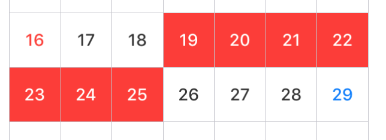
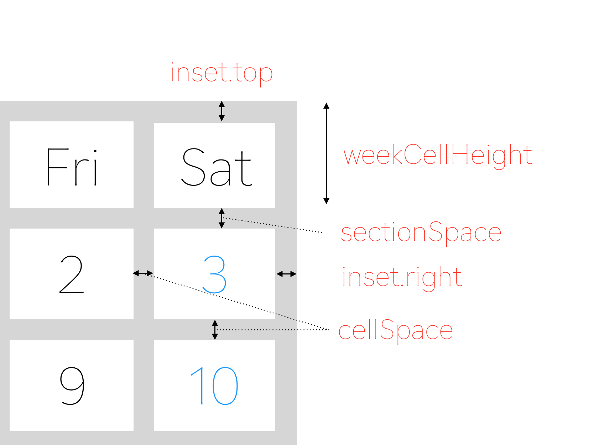

# Koyomi


[](https://developer.apple.com/swift)
[](http://mit-license.org)

**Koyomi** is a simple calender view framework for iOS, written in Swift :calendar:


<p align="center">

</p>

## :octocat: Features

- Simple Calender View :calendar:
- Easily usable :sunglasses:
- Customizable in any properties for appearance
- [x] Support `@IBDesignable` and `@IBInspectable`
- [x] Support Swift 2.3
- [ ] Support Swift 3.0

## Demo App

Open `Example/Koyomi.xcworkspace` and run `Koyomi-Example` to see a simple demonstration.

## Usage

***Koyomi*** is designed to be easy to use :sunglasses:

<p align="center">

</p>


```swift
    let frame = CGRect(x: 10, y : 20, width: 250, height: 300)
    let koyomi = Koyomi(frame: frame, sectionSpace: 1.5, cellSpace: 0.5, inset: UIEdgeInsetsZero, weekCellHeight: 25)
    view.addSubview(koyomi)
```

`Koyomi` is available in Interface Builder.
Set custom class of `UICollectionView ` to `Koyomi`

```swift
    @IBOutlet weak var koyomi: Koyomi!
```

### :calendar: Change displayed month

If you want to change displayed month, call `display(in: MonthType)`. `MonthType` is defined by three types.

```swift
    public enum MonthType { case previous, current, next }
    
    // change month
    koyomi.display(in: .next)
```

### Get current month string

```swift  
    let currentDateString = koyomi.currentDateString(withFormat: "M/yyyy")
```

### Select date
 
```swift
    let today = NSDate()
    let components = NSDateComponents()
    components.day = 7
    let weekLaterDay = NSCalendar.currentCalendar().dateByAddingComponents(components, toDate: today, options: NSCalendarOptions(rawValue: 0))
    koyomi.select(date: NSDate(), to: weekLaterDay)
    
    // If want to select only one day, call koyomi.select(date: today)
```

<p align="center">

</p>

You can configure day color in selected state.

```swift
    // Support @IBInspectable
    @IBInspectable public var selectedBackgroundColor: UIColor
    @IBInspectable public var selectedTextColor: UIColor
```

## KoyomiDelegate

If you want to use `KoyomiDelegate`, set `calenderDelegate` to `target`

```swift
    koyomi.calenderDelegate = self
```

Return the date user selected, when tapped cell

```swift
    optional func koyomi(koyomi: Koyomi, didSelect date: NSDate, forItemAt indexPath: NSIndexPath)    
```

Return the current month string, when changed month.

```swift
    optional func koyomi(koyomi: Koyomi, currentDateString dateString: String)
    
    // if you want to change string format, use `currentDateFormat`
    koyomi.currentDateFormat = "M/yyyy"
```

## :wrench: Customize ***Koyomi***

### Customize layout

```swift
    // Support @IBInspectable
    @IBInspectable var sectionSpace: CGFloa
    @IBInspectable var cellSpace: CGFloat
    @IBInspectable var weekCellHeight: CGFloat
    // Public method
    public var inset: UIEdgeInsets
```

<p align="center">

</p>

```swift
    koyomi.inset = UIEdgeInsets(top: 0.5, left: 0.5, bottom: 0.5, right: 0.5)
```

Set `sectionSpace`, `cellSpace`, `weekCellHeight` in initialization or Interface Builder.


### Customize text font

```swift
    // set Day and Week Label Font
    koyomi
        .setDayFont(size: 12) 
        .setWeekFont(size: 8)
        
    // if want to change font name, use: 
    // setDayFont(fontName: ".SFUIText-Medium", size: 12)
 ```
 
### Customize weeks text
 
 ```swift
    koyomi.weeks = ["Sun", "Mon", "Tue", "Wed", "Thu", "Fri", "Sat"]
```

## Customize color

```swift
    // Support @IBInspectable
    @IBInspectable public var sectionSeparatorColor: UIColor
    @IBInspectable public var separatorColor: UIColor
    @IBInspectable public var weekColor: UIColor
    @IBInspectable public var weekdayColor: UIColor
    @IBInspectable public var holidayColor: UIColor
    @IBInspectable public var otherMonthColor: UIColor
    @IBInspectable public var dayBackgrondColor: UIColor
    @IBInspectable public var weekBackgrondColor: UIColor
    @IBInspectable public var selectedBackgroundColor: UIColor
    @IBInspectable public var selectedTextColor: UIColor
```

You can configure the lots of color properties for appearance :weary:

Don't worry :stuck_out_tongue_closed_eyes:, you can easily configure appearance by using `KoyomiStyle`.

```swift
    koyomi.style = .tealBlue
```

<p align="center">

</p>

`KoyomiStyle` is defined by 10 types.

```swift
    enum KoyomiStyle {
        case monotone, standard, red, orange, yellow, tealBlue, blue, purple, green, pink
    }
```

## :pencil: Requirements

- iOS 8.0+
- Xcode 8.0+

## :computer: Installation
Koyomi is available through [CocoaPods](http://cocoapods.org). To install it, simply add the following line to your Podfile:

```ruby
pod "Koyomi"
```

## :coffee: Author

shoheiyokoyama, shohei.yok0602@gmail.com

## :unlock: License

***Koyomi*** is available under the MIT license. See the [LICENSE file](https://github.com/shoheiyokoyama/Koyomi/blob/master/LICENSE) for more info.
